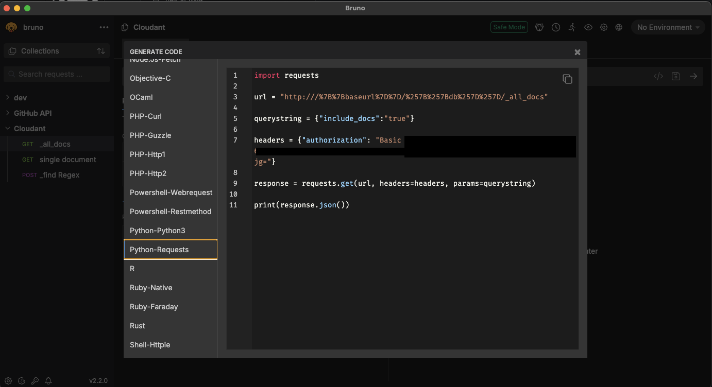

# API Test Client

[Bruno](https://www.usebruno.com/) is a lightweight, open-source API client designed for developers who prefer storing their collections in version control. In this course, we'll use Bruno to **test our deployed backend**.

> If you haven’t installed Bruno yet, refer to the [installation guide](./1_pre-requisites.md#3-bruno-api-test-client).

## Why Bruno?

- Local-first, Git-friendly API collections.
- Open-source and privacy-focused.
- Fast, responsive, and simple to use.
- Ideal for REST API testing.

## Getting Started with Bruno

#### Adding variables in Bruno

1. Open your collection in Bruno.
2. Go to the **Vars** tab.
3. Add the following variable:

- Name: baseUrl
- Value: http://localhost:8000

These variable can now be used throughout your requests.

#### Using Variables in Requests

In your request URL, use double curly braces as the URL `{{baseUrl}}`

Bruno will automatically substitute the values with [collection variables](https://docs.usebruno.com/testing/script/vars) when sending the request.

#### Setting Authentication on the Collection

To apply authentication across all requests in a collection:

1. Open the collection.
2. Navigate to the **Auth** tab.
3. Select **Basic Auth**
   - Username: your username
   - Password: your password
4. Save changes.

### Creating a GET Request

1. Open Bruno and create a new workspace.
2. Create a new collection (e.g., `dev`).
3. Add a new request:
   - Method: `GET`
   - URL: `{{baseUrl}}`
4. Set the `Auth` type to `Basic Auth` and enter your username + password
5. Click **Send** and inspect the response.

#### OPTIONAL: Code generation

Once you successfully managed to use an API, you can use Bruno to generate code samples in various languages / libraries  

