# Container to Cloud

## Link to documentation

The documentation is hosted here [https://raptho.github.io/container-to-cloud/](https://raptho.github.io/container-to-cloud/)

## Course content

This course will enable you to:

- Build a small Python FastAPI backend.
- Test the app using an API Test Client
- Containerize your Python FastAPI backend
- Upload the container image to IBM Container Registry
- Deploy the container image to IBM Code Engine
- Rollout updates of your FastAPI backend

## Chapters

- [Fundamentals](0_Theory.md)
- [Install pre-requisites](./1_Pre-requisites.md)
- [The Python app](./2_The_Python_app.md)
- [Test the app](./3_API-client.md)
- [Containerization](./4_Containerization.md)
- [Deploy on IBM Cloud](./5_Deploy_on_IBM-Cloud.md)
- [Upgrade the app's version](./6_Upgrade_your_app_version.md)

## Architecture

The diagram illustrates the complete workflow:

1. **Local Development**:

   - Create a Python FastAPI application
   - Define a Containerfile
   - Build a container image using Podman/Docker

2. **IBM Container Registry**:

   - Tag the local image with the IBM Container Registry URL
   - Push the container image to IBM Container Registry

3. **IBM Code Engine**:
   - Create secrets for registry access and API credentials
   - Deploy the container from IBM Container Registry to IBM Code Engine
   - The application runs with the configured environment variables
